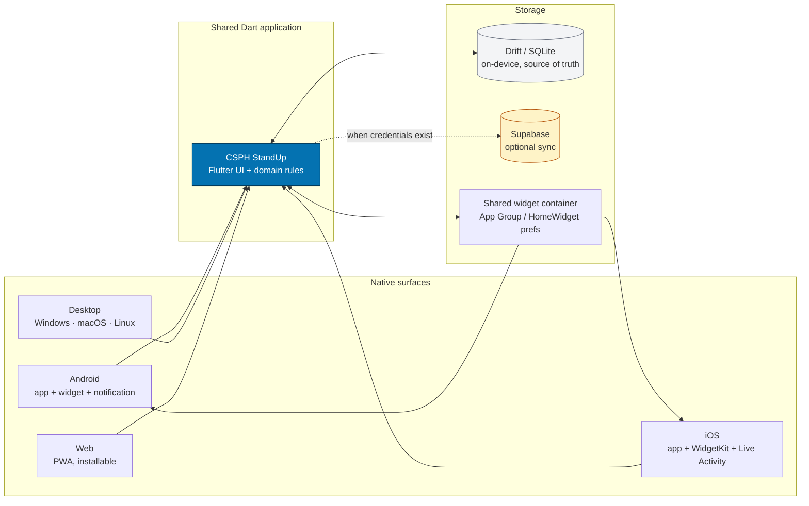
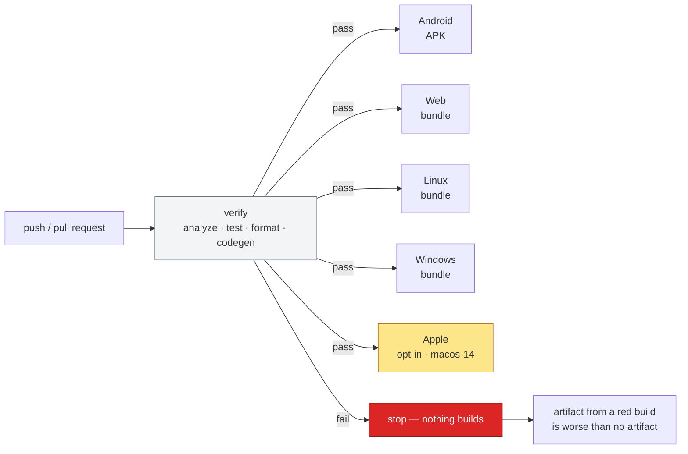
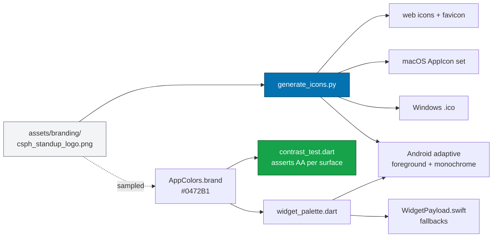

# StandUp: Cross-Platform Employee Health & Wellness Reminder App

[](https://github.com/menoc61/standup/actions/workflows/ci.yml)
[](https://docs.flutter.dev/release/release-notes)
[](https://dart.dev)
[](LICENSE)
[](CONTRIBUTING.md)

   

> **Flutter + Supabase + Drift (SQLite)**  
> Truly cross-platform (Web, macOS, Windows, Linux, iOS, Android) employee wellness application that encourages teams to stand up, stretch, and move for 5 minutes every hour to eliminate posture fatigue and sedentary health risks.

The default interface language is French for CSPH Cameroon; English is selectable in **Settings → Language**. Language choice is stored on the device.



One codebase, six platforms. On-device Drift is always the source of truth;
Supabase is an optional mirror that the app works fully without.

---

## 🌟 Key Features

0. **The Action Window — the core rule**
   - A movement break counts **only in the last 5 minutes of each hour**, measured against the device's local clock. Outside that window the primary action is visibly disabled and the reason is always on screen.
   - Reminders fire at the moment the window opens, so the alert and the rule always agree.
   - Snoozing advances to the *next* window rather than granting an immediate extra break, so snoozes cannot be accumulated to farm credit.
   - The window length and whether it is enforced at all are both configurable in **Settings → Reminder Cadence**.

1. **Progress & Competition**
   - XP per completed break, level curve, and a daily-goal ring.
   - Leaderboard tab: department standings from anonymized org aggregates when online, personal bests offline.
   - Level badge, streak counter and goal progress on the Home dashboard.
   - Celebrations: particle burst, success chime and haptic pulse on each completed break.

2. **Extensive 10-Slide Onboarding Flow**
   - **Slide 1: Welcome & Mission** — Animated posture avatar and wellness cadence introduction.
   - **Slide 2: The Sedentary Trap** — Medical breakdown of prolonged sitting risks (spinal compression, circulation drop, fatigue).
   - **Slide 3: The 5-Minute Solution** — Science-backed benefits (+32% focus, lumbar decompression, stabilizer activation).
   - **Slide 4: How It Works** — Walkthrough of reminders, snooze, skips, and analytics.
   - **Slide 5: Employee Profile Setup** — Name, role/designation, department selection, work email.
   - **Slide 6: Organization Link** — Explains private workspace membership; connect an account and join with an invite code from Settings.
   - **Slide 7: Preferences & Cadence** — Frequency interval (30/60/90 mins), theme (System/Light/Dark), accent color (Emerald, Teal, Amber, Indigo, Coral), and sound preview.
   - **Slide 8: System Permissions** — Notification alerts and exact system timers.
   - **Slide 9: Privacy by Design** — Explains local Drift database vs. anonymized aggregates with opt-in toggle.
   - **Slide 10: Ready To Go** — Interactive posture stance and habit launch.

2. **Kinematic Posture Avatar (`PostureAvatar`)**
   - Pure Flutter CustomPainter with smooth 60/120fps skeletal kinematics.
   - Realistic breathing cycle with radial aura glow.
   - Dynamic states: sitting slumped at desk vs. standing tall with outstretched arms during break mode.

3. **Smart Notification Engine & Audio Feedback**
   - Timezone-aware exact alarms scheduled via `flutter_local_notifications`.
   - Melodic audio cues via `audioplayers` (`chime.wav`, `success.wav`, `nudge.wav`, `click.wav`).
   - Three instant actions:
     - **"I Stood Up!"**: Logs 5 min movement, awards completed break, resets consecutive skips, reschedules cadence.
     - **"Snooze 10m"**: Delays break for 10 minutes (ideal during active presentations or meetings).
     - **"Skip"**: Records missed break and tracks skips.
   - **3-Consecutive-Skips Nudge Logic**: When 3 consecutive breaks are missed, automatically fires a gentle encouragement nudge with a dedicated audio tone.

4. **GitHub-Style Contribution Heatmap**
   - Responsive horizontal 52-week activity grid.
   - 4-Tier GitHub-standard coloring:
     - **Emerald / Green shades**: Completed stand-ups (intensity scales from 1 to 6+ stands).
     - **Amber / Yellow**: Snoozed breaks.
     - **Coral / Red**: Skipped breaks.
     - **Slate / Grey**: Rest days / no activity.
   - Tap any day to inspect full modal breakdown (exact date, stands completed, minutes active, adherence rate).

5. **5-Minute Guided Desk Stretch Routine**
   - In-app interactive routine with 60-second steps:
     1. Overhead Reach & Spinal Stretch
     2. Chest Opener & Shoulder Retraction
     3. Standing Quad & Hip Flexor Stretch
     4. Standing Calf Raises (pumping leg venous circulation)
     5. Gentle Torso Twists
   - Guided countdown timer with one-tap completion.

6. **Organization Health Insights (Admin View)**
   - Materialized / PostgreSQL view aggregates across departments.
   - Company adherence benchmark and active employee count.
   - Department leaderboard (Engineering, Product & Design, Marketing, Operations).
   - Peak skip hours analysis to identify meeting overlaps and deep work fatigue.
   - **Strict Privacy RLS**: No personal timestamps or individual employee logs are exposed to administrators.

7. **Adaptive Multi-Platform Layout**
   - Automatically switches between bottom `NavigationBar` on mobile (<720px) and side `NavigationRail` on desktop/tablet (>=720px).
   - **Floating round reminder control** pinned bottom-left, separate from the bottom navigation, opening the quick action sheet (stand up / snooze / skip / stretch).
   - Pull down on Home, Leaderboard, Analytics or Settings to sync with Supabase.
8. **Account and Workspace Services**
   - Email/password sign-up and sign-in, magic links, and Google/Apple OAuth through Supabase Auth.
   - First sign-in reassigns the device's local profile, preferences, and history to the authenticated user in one local database transaction.
   - Workspace invite codes are checked by a restricted database function; administrators cannot read individual activity.
   - Opted-in accounts receive realtime updates for their own daily summaries; reminder-level action history remains device-local.
9. **Preferences**
   - Language (fr/en), team and workspace label, reminder cadence, daily stand goal.
   - Reminder tone picker, vibration/haptics toggle, quiet hours, notification permission, background-run opt-in, and local CSV export.

---

## 🛠️ Technology Stack

| Layer | Technology |
|---|---|
| **Framework** | Flutter 3.47+ / Dart 3.13+ |
| **Local Database** | Drift 2.35 (SQLite) + `sqlite3_flutter_libs` (Offline-First) |
| **Cloud Backend** | Supabase (PostgreSQL, Auth, Realtime, RLS) via `supabase_flutter` |
| **Notifications** | `flutter_local_notifications` + `timezone` |
| **Audio** | `audioplayers` (synthesized custom acoustic WAVs) |
| **Charts** | `fl_chart` (Bar & Line charts) + Custom GitHub Heatmap Widget |
| **Animations** | `flutter_animate` + Custom Physics `SpringButton` |
| **Gamification** | Local XP/level engine (`GamificationMetrics`) |
| **Time rules** | `StandWindow` action window + `ClockIntegrityGuard` |

---

## 🚀 Getting Started

For complete device setup, platform requirements, Supabase configuration, build paths, and launch commands, see **[Install and launch StandUp](docs/INSTALL_AND_LAUNCH.md)**.

### 1. Prerequisites
- [Flutter SDK](https://flutter.dev/docs/get-started/install) (version 3.x+)
- Dart 3.x+

### 2. Install Dependencies
```bash
flutter pub get
```

### 3. Generate Database Code (Drift)
If modifying database tables in `lib/data/local/app_database.dart`:
```bash
dart run build_runner build --delete-conflicting-outputs
```

### 4. Supabase Setup
1. Create a project at [supabase.com](https://supabase.com).
2. Open the **SQL Editor** in your Supabase project dashboard.
3. Paste and run the complete schema script from [`supabase_schema.sql`](supabase_schema.sql).
4. Pass the project URL and publishable key at build/run time:
   ```bash
   flutter run --dart-define=SUPABASE_URL=https://YOUR_PROJECT_ID.supabase.co --dart-define=SUPABASE_PUBLISHABLE_KEY=YOUR_PUBLISHABLE_KEY
   ```
5. Enable Email auth in Supabase. Add Google and Apple credentials in Supabase if those providers are needed. For native iOS, Android, and macOS builds, add `standup://login-callback` to the Auth URL allow list. The app registers this callback scheme on those platforms. Web uses the configured Site URL.
6. Provision real organizations and unique invite codes through a trusted administrative channel; the schema intentionally contains no sample organizations or codes.

*(Note: If Supabase credentials are not provided or the device is offline, the app operates completely offline using Drift SQLite without any disruption!)*

> **Service boundaries:** OAuth providers must be configured with provider credentials in the Supabase dashboard. OAuth callbacks are supported on web, iOS, Android, and macOS; Windows/Linux use email/password sign-in because native callback registration is not included in the current launchers. Account switching between multiple local profiles is not supported yet. Organization analytics need real workspace provisioning and at least five active contributors in the same cohort; until then, personal reminders and history continue to work locally.

The web build now uses Drift's SQLite WebAssembly backend and browser storage instead of an in-memory database. Mobile and desktop reminders use OS-scheduled local notifications, with a rolling queue of up to 48 alerts. The queue refreshes when the app starts, resumes, or a reminder is handled. iOS and Android can still defer delivery based on system settings; Xiaomi/Redmi devices may need StandUp allowed to run in the background. Linux timers and browser reminders require the app or tab to remain open.

**CSPH Supabase setup:** the client accepts only the CSPH project's URL and publishable key through `--dart-define`. The connected Supabase MCP currently exposes only inactive `xmoni` and `farmassist` projects, so neither is used for CSPH. See the install guide before enabling cloud accounts; do not paste a service-role key into the client.

---

## 🧪 Testing & Verification

Run the test suite:
```bash
flutter test
```

Run static code analysis:
```bash
flutter analyze
```

---

## 💻 Running the App

### Web (Chrome)
```bash
flutter run -d chrome
```

### Windows Desktop
```bash
flutter run -d windows
```

### macOS Desktop
```bash
flutter run -d macos
```

### Android Emulator / Device
```bash
flutter run -d android
```

### iOS Simulator
```bash
flutter run -d ios
```

### Platform-aware behavior

The interface selects its navigation and dashboard composition from the available window width. Touch-sized bottom navigation is used on compact windows; wider windows get a keyboard-friendly sidebar and a two-column dashboard. Flutter's native gesture and animation APIs provide press feedback, hover states, onboarding swipes, and reduced-motion-aware page transitions. GSAP and React Native Gesture Handler are not part of this Flutter codebase.

Reminder delivery is implemented with each platform's available notification mechanism. Exact-time delivery and permission prompts vary by OS and user settings; Linux and browser reminders require the app or tab to remain open. Windows desktop builds require Visual Studio's C++ desktop workload. See the install guide for build prerequisites and known platform limits.

---

## 📂 Architecture Overview

```
lib/
├── core/
│   ├── app_colors.dart         # Brand palette, white light surfaces & status tokens
│   ├── app_strings.dart        # Bilingual fr/en dictionary (fr default)
│   └── app_theme.dart          # Adaptive Material 3 light/dark theme builder
├── data/
│   ├── local/
│   │   ├── app_database.dart   # Drift SQLite tables & connection (schema v3)
│   │   ├── app_database.g.dart # Generated Drift ORM code
│   │   └── local_repository.dart # Type-safe reactive repository & queries
│   ├── models/
│   │   ├── user_profile.dart   # Employee profile model
│   │   ├── user_preferences.dart # Cadence, theme, sound, quiet hours, goal
│   │   ├── reminder_log.dart   # Individual private reminder action log
│   │   ├── daily_analytics.dart # Daily adherence & stand minutes summary
│   │   ├── org_analytics.dart  # Aggregated company benchmarks & departments
│   │   ├── gamification_metrics.dart # XP, levels & daily goal maths
│   │   ├── leaderboard.dart    # Standings builders (org + personal)
│   │   ├── stand_window.dart   # Hourly action window & clock-integrity guard
│   │   ├── device_profile.dart # Transparent, auditable device metadata
│   │   └── workday_metrics.dart # Adherence, streak & reminder clock
│   └── remote/
│       └── supabase_service.dart # Supabase client, RLS queries & offline sync
├── providers/
│   └── app_state.dart          # Central reactive ChangeNotifier state & timer
├── services/
│   ├── audio_service.dart      # Reminder tone picker, chimes & celebrations
│   ├── haptics_service.dart    # Native vibration helpers
│   ├── notification_service.dart # Scheduled reminders, actions & nudges
│   └── background_run_service.dart # Android battery-exemption bridge
└── ui/
    ├── screens/
    │   ├── splash_screen.dart  # Animated breathing logo entrance
    │   ├── main_shell.dart     # Responsive glass nav + round reminder button
    │   ├── home_screen.dart    # Level strip, countdown ring, avatar, stretch guide
    │   ├── leaderboard_screen.dart # XP, level, streak & standings
    │   ├── analytics_screen.dart # GitHub heatmap & fl_chart breakdowns
    │   ├── org_admin_screen.dart # Anonymized company health & skip hours
    │   ├── settings_screen.dart# Preferences, account, sync & export
    │   └── onboarding/
    │       ├── onboarding_screen.dart # 10-slide journey controller
    │       └── slide_widgets.dart    # Individual slide components
    └── widgets/
        ├── glass_card.dart      # Shared glassmorphic surface
        ├── reminder_fab.dart    # Round floating reminder control
        ├── countdown_ring.dart  # Radial progress countdown with aura
        ├── posture_avatar.dart  # Kinematic custom-painted posture character
        ├── spring_button.dart   # Tactile physics bouncing button
        ├── dynamic_island.dart  # Morphing reminder pill
        ├── particle_burst.dart  # Celebration confetti
        ├── contribution_heatmap_widget.dart # GitHub-style 52-week heatmap
        └── analytics_charts.dart # Weekly bar & 30-day line charts
```

Supabase setup is documented end to end in **[docs/SUPABASE_SETUP.md](docs/SUPABASE_SETUP.md)**:
create the project, apply `supabase_schema.sql` then `supabase_validation.sql`, configure
auth and redirect URLs, provision an organization, and pass the publishable key via
`--dart-define`.

---

## 🔒 Privacy Architecture

1. **Local Isolation**: Every specific stand-up timestamp, snooze delay, and personal skip reason is stored inside the device's private SQLite database.
2. **Row-Level Security (RLS)**: Profiles and individual reminder logs in Supabase can only be viewed and edited by `auth.uid() = user_id`.
3. **Anonymized Aggregates**: Organization administrators only have access to the `org_analytics_daily` view which performs `GROUP BY organization_id, date` without exposing individual identities.
4. **Voluntary Opt-In**: Employees can toggle "Contribute to Org Statistics" off in Settings or during onboarding to keep their data 100% local.
5. **Server-Side Validation**: `supabase_validation.sql` adds a `record_daily_analytics()` function that derives the user id from the JWT and the organization from the private profile, rejects inconsistent or implausible totals, only ever increases counters, and flags suspicious rows so they never reach the aggregate views. Direct writes to `analytics_daily` are revoked.
6. **No IP or Location Collection — deliberately**. An earlier design request asked for the device IP address; it was declined. Pairing an IP with per-employee break timestamps turns a wellness app into individual employee monitoring, contradicts the aggregation guarantees above, and is personal data under both the GDPR and Cameroon's data-protection law. Resolving an IP would also require a third-party lookup service, leaking every user's address to that service.

   What *is* collected is operational metadata only — device type, OS and version, app version, screen size, locale and time zone — read from the device itself, stored locally, and shown in full to the user under **Settings → Device & app**, where the exact JSON payload can be reviewed and copied before anything syncs.

## 🛡️ What "no bypass" actually means here

A local-first app cannot be made tamper-proof: the Drift database is a plain SQLite file on the user's own device, and the device clock can be changed. Claiming otherwise would be dishonest. What the app does implement, in layers:

| Layer | Mechanism | Stops |
| --- | --- | --- |
| UI | Window gate + visible countdown; rejected taps always explain why | Accidental taps, confusion about the rule |
| App state | One completion per window, keyed on the window boundary | Notification tap racing an in-app tap double-counting |
| App state | `ClockIntegrityGuard` compares consecutive wall-clock readings inside the running process | Backwards clock jumps and large forward jumps |
| Server | `record_daily_analytics()` rejects negatives, impossible totals, future dates, action breakdowns that exceed reminders sent, stand minutes exceeding completed breaks, and implausible day-over-day jumps | Forged rows reaching the organization dashboards |
| Server | Sticky `trusted` flag, revision ceiling, `clock_suspect` | Laundering a distrusted row back in with a later clean-looking write |

A determined user with a rooted phone can still edit their own device. What they cannot do, without server access, is move their number on somebody else's leaderboard.

## 🔁 Continuous Integration

`.github/workflows/ci.yml` runs on every push and pull request. Every job is
gated behind `verify`, so a linter warning or failing test stops the builds
rather than letting them run to completion and produce broken artifacts.

| Job | Runner | Output |
| --- | --- | --- |
| `verify` | `ubuntu-latest` | Analysis, 142 tests, `dart format` check, Drift codegen freshness |
| `build-android` | `ubuntu-latest` | Release APK (R8 enabled) |
| `build-web` | `ubuntu-latest` | Release web bundle incl. Drift WASM assets |
| `build-linux` | `ubuntu-latest` | Release Linux bundle |
| `build-windows` | `windows-latest` | Release Windows bundle |
| `build-apple` | `macos-14` | iOS + macOS release — **opt-in** via `vars.RUN_APPLE_CI` |

Android, web, Linux and Windows build on stock hosted runners. Apple builds are
opt-in because they are unsigned (no signing identity is configured) and the
WidgetKit extension must be installed first; see
[docs/PLATFORM_SETUP.md](docs/PLATFORM_SETUP.md).

Set `Settings → Secrets → SUPABASE_URL` and `SUPABASE_PUBLISHABLE_KEY` to inject
credentials from the environment rather than committing them.



Every build is gated behind `verify`, so a lint warning or a failing test stops
the pipeline instead of letting it produce artifacts that are broken in a way the
log does not explain.

---

## 📚 Further documentation

| Document | Covers |
| --- | --- |
| [docs/ARCHITECTURE.md](docs/ARCHITECTURE.md) | Layering, state management, adaptive layout, the reminder state machine, testing |
| [docs/PLATFORM_SETUP.md](docs/PLATFORM_SETUP.md) | Per-platform prerequisites, WidgetKit target install, the widget action round trip |
| [docs/SUPABASE_SETUP.md](docs/SUPABASE_SETUP.md) | Environment variables, schema, validation queries |
| [docs/INSTALL_AND_LAUNCH.md](docs/INSTALL_AND_LAUNCH.md) | Getting the app running on a device |

## 🎨 Branding and app icons

Every platform icon is **generated** from the single brand asset
`assets/branding/csph_standup_logo.png`. If you change the logo, regenerate
everything:

```bash
python scripts/icons/generate_icons.py   # requires Pillow
```

This writes the PWA icon set and favicon, the macOS `AppIcon` set, the Windows
`.ico` (multi-resolution), and the Android adaptive foreground and monochrome
layers. Generating rather than hand-editing is deliberate: the previous state had
Android on the new mark while web and macOS were still the stock Flutter logo,
which is invisible in review because every file just looks like "a png".

The brand colour is **sampled** from that asset rather than hardcoded, and
`test/contrast_test.dart` asserts both the sampled value and that the accent
clears WCAG AA on each surface. Re-export the logo and the test tells you the
colour changed, instead of letting the app quietly drift from its own mark.

> ⚠️ **The current asset is a placeholder.** It was upscaled from a 178×157
> JPEG, so the shipped icons are soft and show JPEG artifacts at large sizes.
> Drop in a 1024×1024 PNG of the same artwork and re-run the generator — no code
> change is needed.

### What a rebrand has to touch

A new mark is more than a picture swap. These are all the places the identity was
duplicated, and a partial rebrand leaves them disagreeing with each other:

| Concern | Location |
| --- | --- |
| Brand tokens and contrast | `lib/core/app_colors.dart`, `test/contrast_test.dart` |
| Widget palette + its fallback | `lib/data/local/widget_palette.dart` |
| Android widget fallbacks | `StandUpWidgetProvider.kt`, `res/layout/`, `res/drawable/` |
| Apple widget fallbacks | `ios/StandUpWidget/WidgetPayload.swift` |
| Browser chrome colour | `web/manifest.json`, `web/index.html` |
| Windows icon corners | `scripts/icons/generate_icons.py` (`BRAND`) |
| Diagram styling | `README.md`, `docs/*.md` |



## 📄 Licence

Source code is MIT — see [LICENSE](LICENSE).

The CSPH name and logo are **not** covered by that licence. They remain the
property of CSPH and may only be used to identify the official application.
