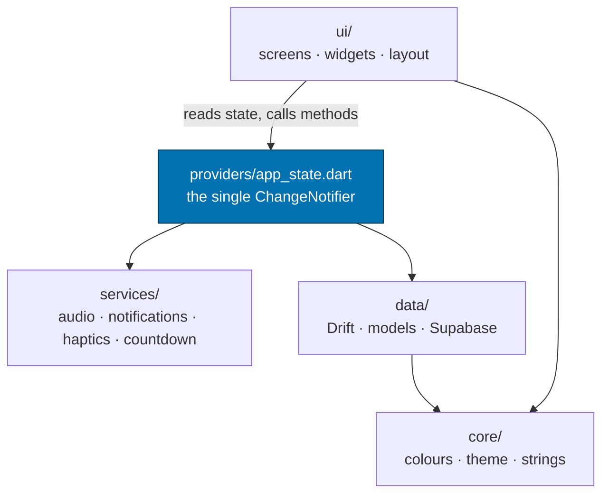
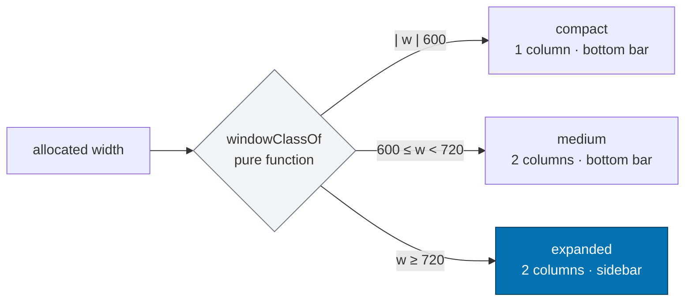
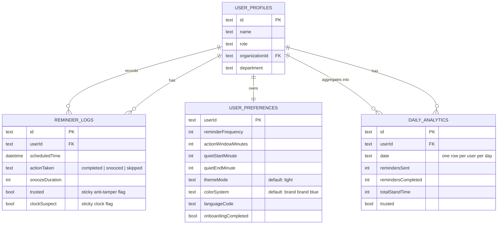
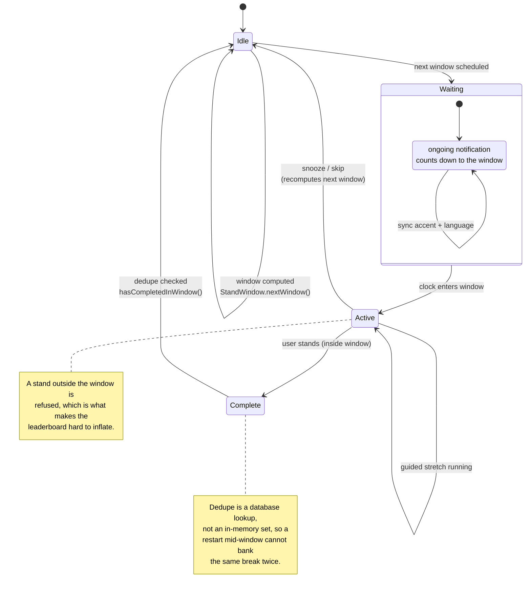

# Architecture

How the code is organised, and why it is organised that way. Read this before
adding a feature, so the new code matches the decisions already made rather than
introducing a second pattern.

---

## The shape of the app

```
lib/
├── main.dart                    Composition root. Owns the screen switch.
├── core/                        Pure, dependency-free. No Flutter services.
├── data/
│   ├── local/                   Drift database, repositories, widget bridge
│   ├── models/                  Value objects and domain rules
│   └── remote/                  Supabase
├── providers/app_state.dart     The single source of truth
├── services/                    Side-effecting capabilities
└── ui/
    ├── layout/adaptive.dart     Breakpoints as pure functions
    ├── screens/                 One file per screen
    └── widgets/                 Reusable pieces
```

The dependency direction is strictly one way:



`core` depends on nothing. `ui` never calls a service directly — it reads state
and calls methods on `AppState`. That is what keeps the widgets testable without
standing up a database, a network client, or a notification plugin.

---

## State management: one notifier, deliberately

There is exactly one `ChangeNotifier` — `AppState` — and no state-management
package. This is a considered choice, not an oversight.

`AppState` is the only thing that knows what time it is relative to a reminder
window, which is also the only thing that decides whether a stand counts. If the
timer, the streak counter, the analytics record and the home-screen widget each
held their own copy of that state, they would disagree the moment the user
changed a setting or the device clock moved. Every screen reads the same
notifier, so they cannot.

**What this buys you**

- `ListenableBuilder` at the root repaints the whole app on any change, so a
  settings change is visible immediately rather than after a round trip to
  storage.
- `notifyListeners()` is called *before* `await`ing persistence in
  `updatePreferences` and `updateLanguage`. The repaint is not gated on disk I/O.

**What it costs**

`AppState` is large. Split it only along a seam that is genuinely independent —
notification presentation and the widget bridge are the two candidates — and keep
the timer and analytics together, because they are one state machine.

### When to add a second notifier

Add a local `StatefulWidget` for animation controllers, scroll offsets, and
hover state. Do **not** add a notifier for anything that another part of the app
must agree on.

---

## Adaptive layout

Breakpoints live in `lib/ui/layout/adaptive.dart` as pure functions over
`BoxConstraints`:

```dart
windowClassOf(constraints)      // compact | medium | expanded
useSidebarNavigation(constraints)
gridColumnCount(constraints)
constrainContent(child)         // centred, capped at kContentMaxWidth
```

**Never branch layout on `MediaQuery.sizeOf`.** It reports the window, not the
space the widget was given, so it is wrong for a desktop app resized narrow, a
phone in split-screen, and picture-in-picture. Use `LayoutBuilder` and the
constraints it hands you.

Never check the device type either. Flutter apps run in resizable windows on
every desktop, so "am I on a phone?" is not a question with a stable answer.

Because the decisions are pure functions, they are unit-tested directly in
`test/adaptive_layout_test.dart` without booting a widget tree.



---

## Data layer

### Drift

The schema is the source of truth. After changing `app_database.dart`, run:

```bash
dart run build_runner build --delete-conflicting-outputs
```

CI fails on a stale `app_database.g.dart`, because a stale generated file is a
class of bug that compiles cleanly and behaves incorrectly.

The browser build needs two assets that `flutter build web` does not copy —
`sqlite3.wasm` and `drift_worker.js`. Both live in the resolved Drift package, so
`copy_drift_web_assets` reads the version from `pubspec.lock` rather than
searching the pub cache. CI runs the same script, so a developer and the pipeline
produce an identical bundle.

### Supabase

`SupabaseService` is constructed with empty credentials when the environment has
none, and the app runs fully offline in that state. This is deliberate: a
developer without credentials should get a working app, not a crash on launch.

Credentials are read from `SUPABASE_URL` and `SUPABASE_PUBLISHABLE_KEY`. Never
put a service-role key in the client or commit one to the repository.

```mermaid
flowchart TD
    START([App launch]) --> ENV{"SUPABASE_URL and<br/>key present?"}
    ENV -->|no| OFF["SupabaseService with empty credentials<br/><b>app runs fully offline</b>"]
    ENV -->|yes| AUTH["signInAnonymously / OAuth"]

    AUTH --> RLS{"Row Level Security<br/>in force?"}
    RLS -->|no| BLOCK["Sync refused<br/>logged, not attempted"]

    OFF --> LOCAL[(("Drift<br/>local truth"))]
    BLOCK --> LOCAL
    AUTH --> LOCAL

    LOCAL -->|"opt-in, anonymised"| WRITE["write own row only"]
    WRITE --> RLS
    RLS -->|"aggregate only"| READ["read org aggregates"]
    READ --> NEVER["never: raw per-user rows,<br/>no individual named"]

    style OFF fill:#f3f4f6,stroke:#6b7280
    style NEVER fill:#16a34a,color:#fff,stroke:#14532d
    style BLOCK fill:#fef3c7,stroke:#b45309
```

### The on-device schema

Drift is the source of truth. The schema below is the contract every other layer
is written against — if a field is not here, no screen may depend on it.



Note the `date` uniqueness on `DAILY_ANALYTICS`: one row per user per day. That
is what makes streak and adherence calculations a single query rather than an
aggregation over raw logs.

---

## Domain rules worth knowing before you change them

- **A break only counts inside its window.** `StandWindow` derives the window
  from local time (`HH:55`–`HH:00` by default). A `complete` outside the window
  is refused, which is what makes the leaderboard resistant to inflation.
- **The guided stretch is bound to the window it started in.** A stretch that
  begins at the end of a window necessarily finishes after it, so its completion
  is honoured via `_breakWindowKey`. Without that binding the completion would be
  refused by the gate that protects a *new* stand action.
- **Completion is deduplicated per window, durably.** `hasCompletedInWindow`
  checks the database, not an in-memory set, so a restart mid-window cannot let a
  user bank the same break twice.
- **Device clock is distrusted.** `clock_suspect` is sticky: a device whose clock
  jumps is not laundered back into good standing by a later well-behaved write.

---

## Widgets and the app boundary

The Dart side writes a snapshot into shared storage; the native side renders it.
There is no shared rendering.

| Concern | Where it lives |
| --- | --- |
| Payload shape and palette serialisation | `data/local/widget_snapshot.dart`, `widget_palette.dart` |
| Android rendering | `StandUpWidgetProvider.kt` + `res/layout/` |
| Apple rendering | `ios/StandUpWidget/` |
| Action round trip | `widget_action_dispatcher.dart`, `WidgetBridge` |

Colours cross the boundary as **resolved** `AARRGGBB` strings (`c_surface`,
`c_accent`, …), never as theme names or indices. A widget that recomputes the
palette itself would drift from the app the moment a preference changed.

An action from a widget is written as a pending record and drained on the next
app resume, on both platforms. See
[PLATFORM_SETUP.md](PLATFORM_SETUP.md#the-interactive-widget-action-round-trip).

---

## Testing

- `test/adaptive_layout_test.dart` — breakpoints as pure functions
- `test/leaderboard_test.dart` — ranking, ties, filtering
- `test/widget_snapshot_test.dart` — the payload contract and palette
- `test/contrast_test.dart` — WCAG contrast of every palette pair
- `test/bilingual_parity_test.dart` — French/English coverage
- `test/segmented_choice_test.dart` — accessibility and keyboard
- `test/live_countdown_test.dart` — notification state machine
- `test/widget_test.dart` — widget smoke tests

Prefer testing a decision as a pure function over testing the widget that
consumes it. Every function in `ui/layout/adaptive.dart` exists in extracted form
for exactly this reason.

`flutter analyze --fatal-infos --fatal-warnings` is the bar, and `dart format` is
enforced in CI. A lint is not a suggestion.

---

## The reminder state machine

The single most important behaviour in the app, and the reason `AppState` cannot
be split casually. A stand counts **only** inside its window; everything else
flows from that rule.



Two consequences that are easy to break by accident:

- Starting a guided stretch **cancels** the countdown notification. Leaving it up
  shows a stuck `0:00` next to an in-progress stretch.
- Every path that recomputes the window — cadence change, snooze, skip, language
  switch — must resync the countdown. They all funnel through
  `_scheduleNextInterval` for exactly this reason; adding a fourth path that
  forgets is the easy regression.