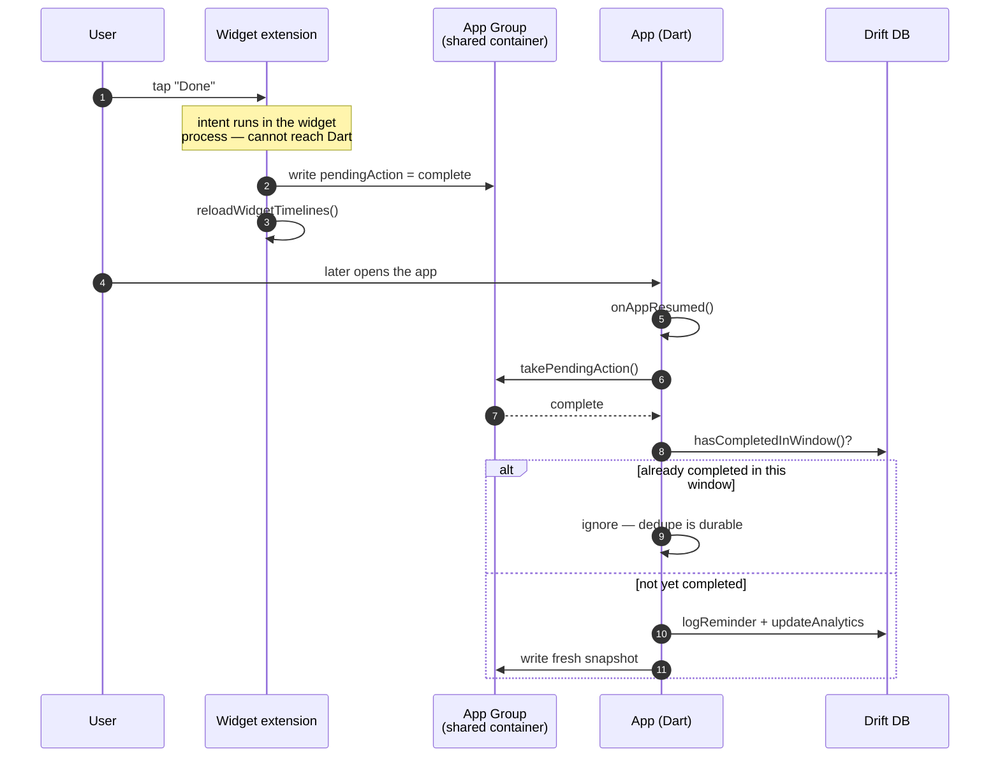
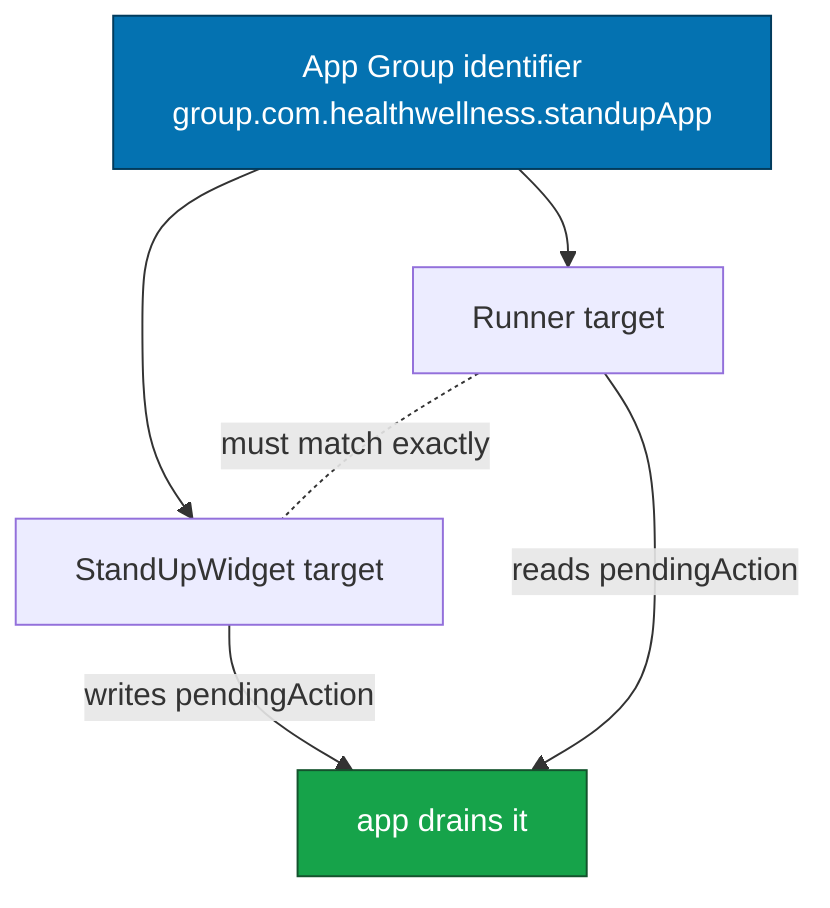

# Platform setup

What each target needs before it will build, and what CI can and cannot do for
you. Written for someone setting this up for the first time.

---

## What builds where

| Target | Builds locally on | Builds in CI | Notes |
| --- | --- | --- | --- |
| Android | Windows, macOS, Linux | `ubuntu-latest` | Needs Android SDK + a JDK |
| Web | Any | `ubuntu-latest` | No native toolchain at all |
| Linux | Linux only | `ubuntu-latest` | GTK, clang, ninja |
| Windows | Windows only | `windows-latest` | Needs Visual Studio **with the C++ workload** |
| macOS | macOS only | `macos-14` (opt-in) | Needs Xcode |
| iOS | macOS only | `macos-14` (opt-in) | Needs Xcode + the WidgetKit target installed |

The platform restriction is not a limitation of the project. Flutter's Windows
embedder links against Win32 and the macOS and Linux embedders link against
Cocoa and GTK respectively, so there is no cross-compilation path for desktop
targets. CI works around it by using a hosted runner of the matching OS.

---

## Android

Nothing special beyond the standard Flutter toolchain. Two things are worth
knowing:

- The adaptive launcher icon has three layers (`background`, `foreground`,
  `monochrome`) defined in
  `android/app/src/main/res/mipmap-anydpi-v26/ic_launcher.xml`. The monochrome
  layer is what Android 13 uses for themed icons; without it the app silently
  opts out of the user's wallpaper palette.
- Notification icons are the small silhouette shown in the status bar. Android
  tints them and ignores colour, so supplying the full-colour logo produces a
  white or black blob.

## Linux

Install the build dependencies once:

```bash
./scripts/standup.sh setup --linux-deps
# or, without the TUI:
sudo apt-get install -y clang cmake ninja-build pkg-config libgtk-3-dev \
  liblzma-dev libstdc++-12-dev libblkid-dev uuid-dev \
  libgstreamer1.0-dev libgstreamer-plugins-base1.0-dev
```

The GStreamer packages are required by `audioplayers_linux`. Omitting them makes
the build fail inside CMake at `pkg_check_modules` with a confusing message
about a package you were never told to install.

## Windows

Requires Visual Studio 2022 with the **Desktop development with C++** workload.
The plain Visual Studio install is not enough; `flutter doctor` will tell you so:

```
[✗] Visual Studio - develop Windows apps.
    ✗ Missing "Visual Studio 2022" component.
```

CI builds this on the hosted `windows-latest` image, which already has the
workload, so the job is not gated.

---

## Apple: WidgetKit and the Dynamic Island

Apple targets need two extra steps that no amount of CI will do for you.

### 1. Install the WidgetKit extension target

The Swift sources live in `ios/StandUpWidget/` but are not part of the Xcode
project until you add them:

```bash
ruby scripts/ios/add_widget_target.rb
open ios/Runner.xcworkspace
```

The script is idempotent — it refuses to add the target twice — so it is safe to
re-run after a `flutter create`. It creates the target with:

- bundle id `<app bundle id>.StandUpWidget`
- deployment target 17.0 (ActivityKit and the interactive widget APIs)
- the `group.<app bundle id>` App Group on **both** targets
- an embed-extension build phase in `Runner`

### 2. Enable the capability on both targets

Signing will fail without this. In Xcode, select **Runner** and
**StandUpWidget**, then for each: *Signing & Capabilities → + Capability → App
Groups*, and enable the group created above.

The App Group is what lets the app write a countdown into the widget's
container, and lets an interactive widget button hand an action back to Dart.

### 3. Enable the Apple CI job

Repository variable `RUN_APPLE_CI = true`. These builds are **unsigned** — CI
has no signing identity — so they are useful for verification and simulator
work, not for App Store submission.

---

## The interactive-widget action round trip

Worth understanding because it is the least obvious part of the Apple setup:

1. The user taps **Done** in the widget.
2. The App Intent runs in the **widget extension** process. It cannot call into
   Dart, and starting the app to reach Dart would defeat the purpose of a
   widget action.
3. Instead the intent writes a small pending-action record into the shared App
   Group container and reloads the timeline.
4. The app drains that record on next `resume`, through
   `AppState.onAppResumed` → `WidgetBridge.takePendingAction`.



So an interactive widget action is applied the next time the user opens the app,
not the instant they tap it. The same durability mechanism applies on Android via
`HomeWidget.registerInteractivityCallback`.

If an action appears to do nothing, check that the App Group identifier matches
exactly on both targets — a mismatch compiles cleanly and silently sends the
pending action to a container nothing is reading.

